# OOP Practice - Veterinary Hospital Reservation Program

- A little project for practicing object-oriented programming, which used encapsulation, polymorphism to build a program that simulates a simple veterinary hospital reservation program.
- Additionally, Model-View-Controller design pattern was applied.

## UML Diagram

<p align=center>
    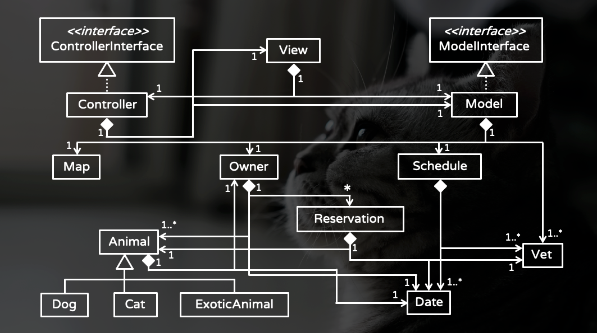
</p>

## Getting Started

To generate executable file:

```bash!
$ make
```

To run the executable:

```bash!
$ make executable
```

## Feature

### Startup

In the beginning, user is asked to register his/her identity:

<p align=center>
    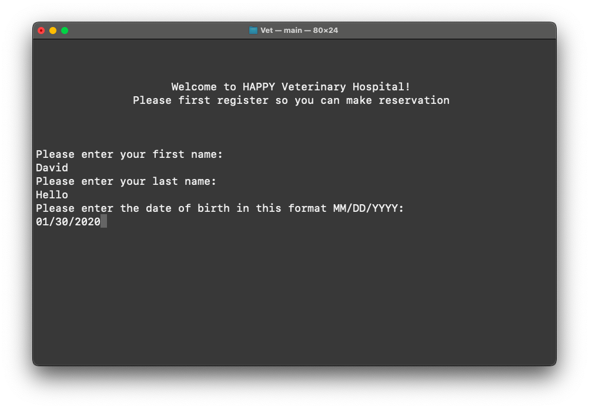
</p>

Also, user has to enter his/her address in this map:

<p align=center>
    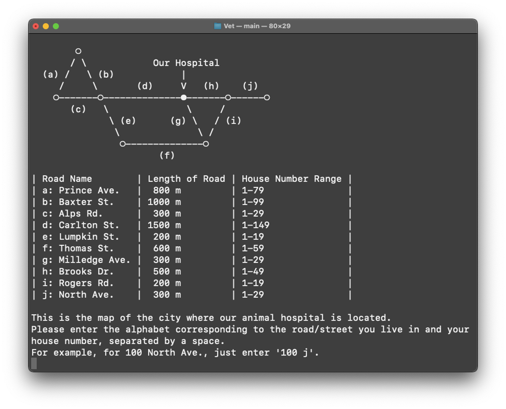
</p>

Next, user has to register his/her first animal:

<p align=center>
    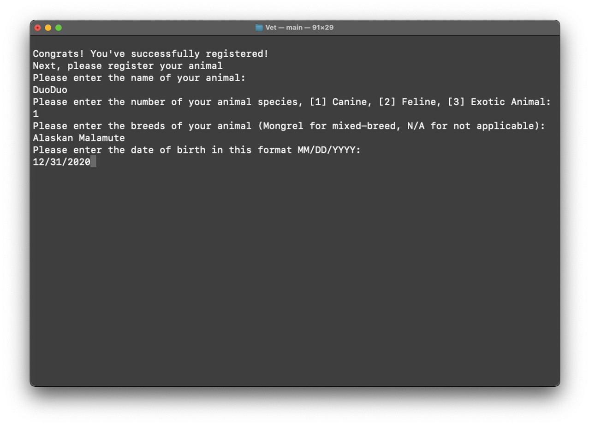
</p>

### Main Menu

Then, user can see the main menu. Just enter the number corresponding to the function and press enter.

<p align=center>
    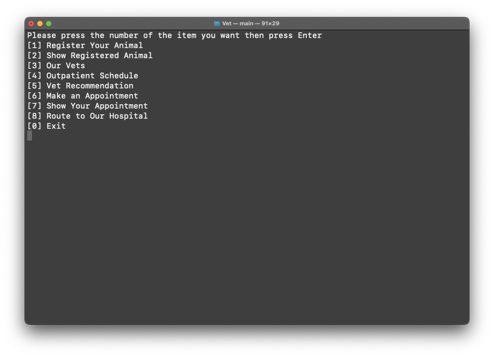
</p>

### Show Registered Pets

This function shows all the information of pets registered by user.

<p align=center>
    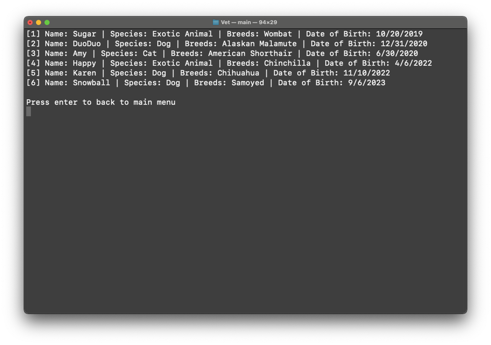
</p>

### Our Vets

This function shows the vets of this veterinary hospital.

<p align=center>
    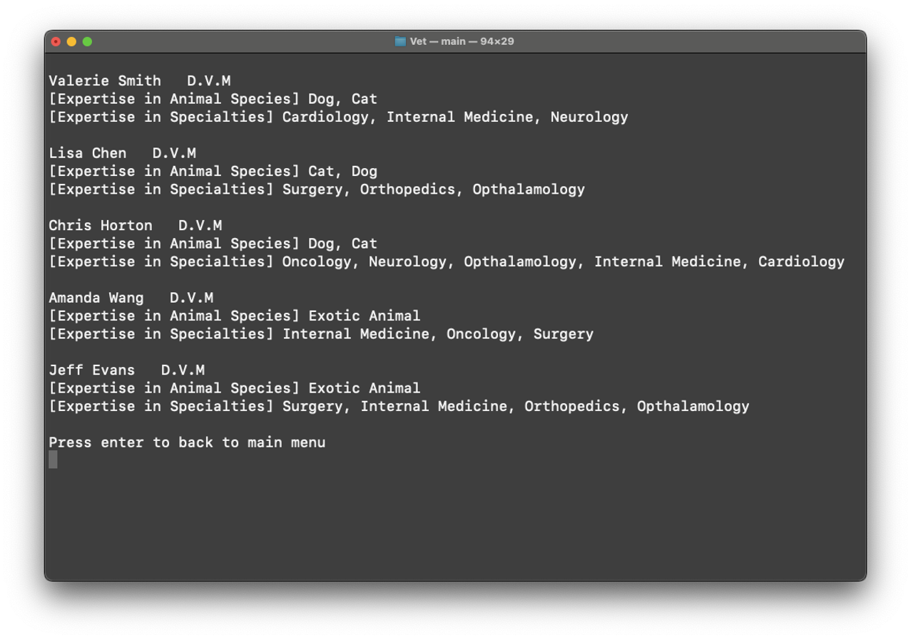
</p>

### Outpatient Schedule

<p align=center>
    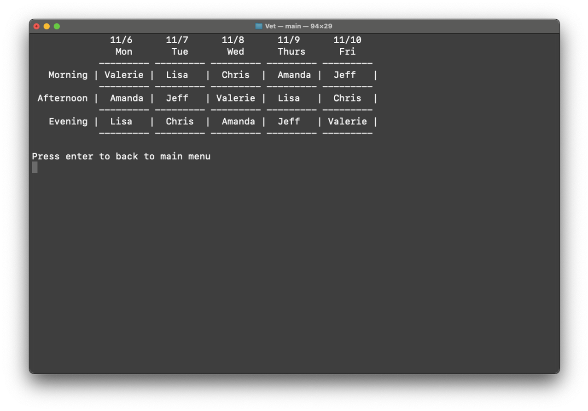
</p>

### Vet Recommendation

By inputting the pet's species and the issue the pet is facing, the algorithm will recommend the most suitable veterinarian for the user.

<p align=center>
    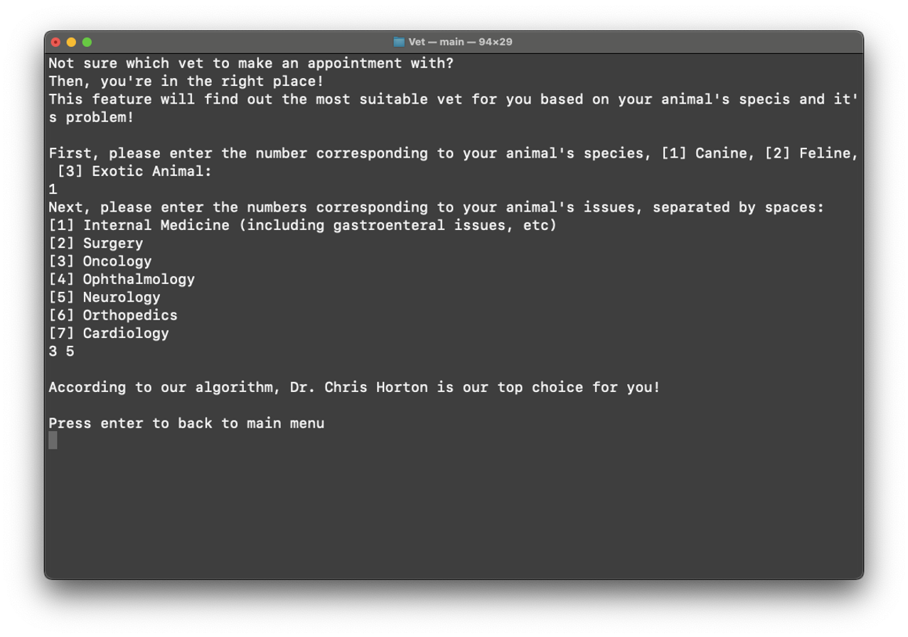
</p>

### Make an Appointment

Make an appointment for your pet!

<p align=center>
    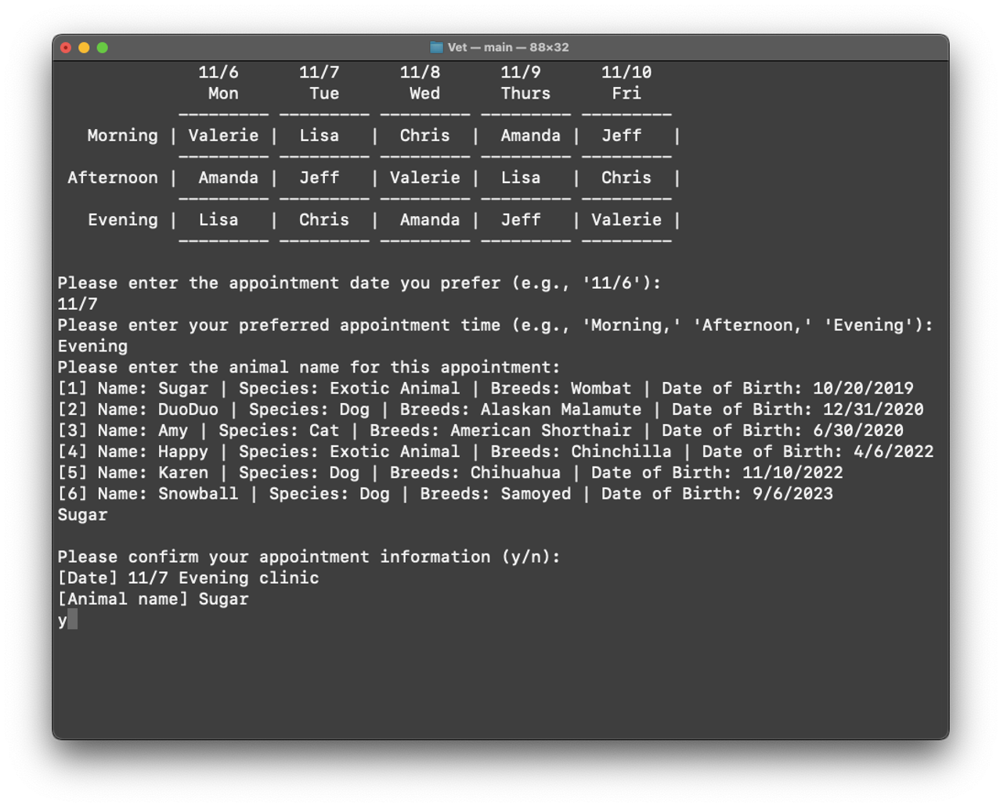
</p>

### Show Your Appointment

Show your appointment(s)!

<p align=center>
    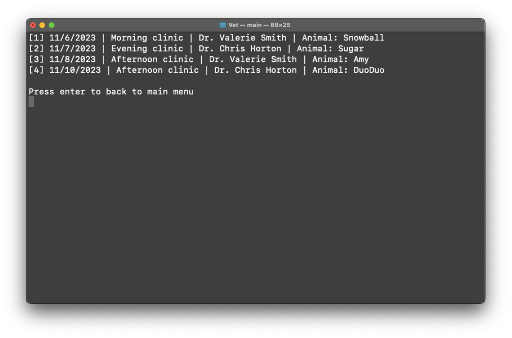
</p>

### Route to Our Hospital

Implementation of Dijkstra algorithm to recommend a shortest path from user's address to the veterinary hospital.

<p align=center>
    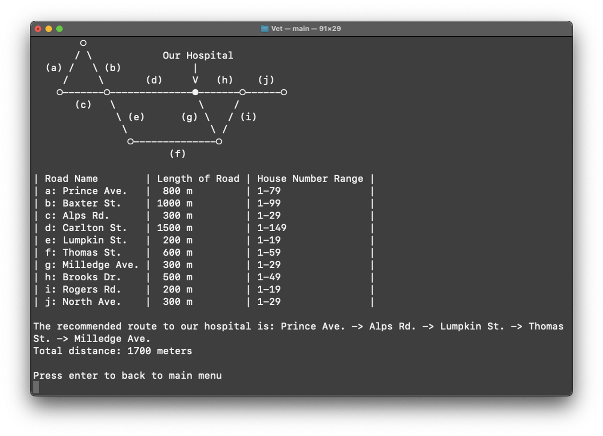
</p>